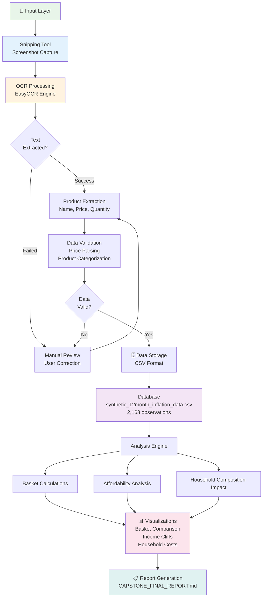

# Snipper Tool Architecture & Data Collection Pipeline

## Diagram 1: System Architecture (Detailed)



---

## Diagram 2: Data Collection Pipeline (Workflow)

```mermaid
graph LR
    subgraph Collection["Collection Phase"]
        A["🏪 Store Visit<br/>Auchan/Carrefour<br/>Paris"]
        B["📸 Receipt Photo<br/>Multiple stores<br/>Multiple dates"]
    end
    
    subgraph Processing["Processing Phase"]
        C["🤖 OCR Recognition<br/>EasyOCR<br/>Extract text from image"]
        D["🏷️ Parse Products<br/>Product name<br/>Price per unit<br/>Quantity"]
        E["✅ Validate Data<br/>Price format<br/>Category mapping<br/>Remove duplicates"]
    end
    
    subgraph Analysis["Analysis Phase"]
        F["📊 Aggregate Data<br/>2,163 observations<br/>55 product categories<br/>12 months"]
        G["🧮 Calculate Baskets<br/>Official: €68.67<br/>Real: €303.65<br/>Healthy: €383.58"]
        H["💰 Affordability<br/>by income level<br/>by household type"]
    end
    
    subgraph Output["Output Phase"]
        I["📈 Visualizations<br/>Charts & graphs"]
        J["📄 Final Report<br/>CAPSTONE_FINAL_REPORT.md<br/>7,500 words"]
    end
    
    A --> B --> C --> D --> E --> F --> G --> H --> I --> J
    
    style Collection fill:#E8F5E9
    style Processing fill:#FFF3E0
    style Analysis fill:#F3E5F5
    style Output fill:#FCE4EC
```



---

## Diagram 3: Affordability Analysis Logic (Decision Tree)

```mermaid
graph TD
    A["Price Data<br/>2,163 observations<br/>55 categories"]
    
    A --> B["Create Three Baskets"]
    
    B --> C1["🔴 Official Basket<br/>INSEE minimal<br/>13 items<br/>€68.67/month"]
    B --> C2["🟡 Real Complete<br/>Family reality<br/>34 items<br/>€303.65/month"]
    B --> C3["🟢 Healthy Basket<br/>Quality + nutrition<br/>41 items<br/>€383.58/month"]
    
    C1 --> D["Compare Against<br/>Paris Income Levels"]
    C2 --> D
    C3 --> D
    
    D --> E1["SMIC<br/>€21,000/year<br/>€1,750/month"]
    D --> E2["Low Income<br/>€28,000/year<br/>€2,333/month"]
    D --> E3["Median<br/>€42,000/year<br/>€3,500/month"]
    D --> E4["Upper Middle<br/>€65,000/year<br/>€5,417/month"]
    
    E1 --> F1["Calculate %<br/>of income"]
    E2 --> F1
    E3 --> F1
    E4 --> F1
    
    F1 --> G{"Affordability<br/>Status?"}
    
    G -->|0-10%| H1["✓ Excellent"]
    G -->|10-15%| H2["✓ Good"]
    G -->|15-20%| H3["⚠ Manageable"]
    G -->|20-30%| H4["⚠ Difficult"]
    G -->|30-50%| H5["✗ Crisis"]
    G -->|50%+| H6["✗ Impossible"]
    
    H1 --> I["Generate<br/>Heatmap +<br/>Visualizations"]
    H2 --> I
    H3 --> I
    H4 --> I
    H5 --> I
    H6 --> I
    
    style A fill:#E3F2FD
    style C1 fill:#FFCDD2
    style C2 fill:#FFF9C4
    style C3 fill:#C8E6C9
    style I fill:#FCE4EC
