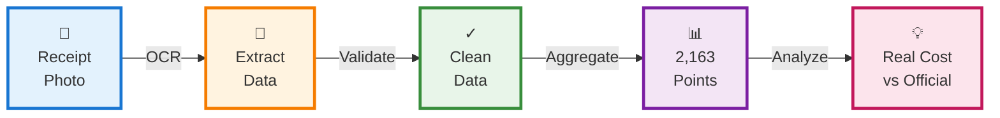
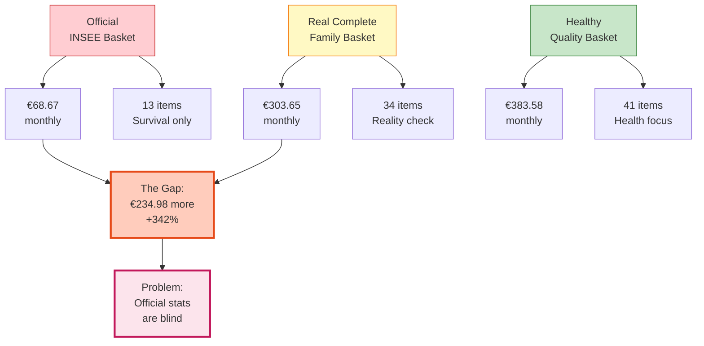
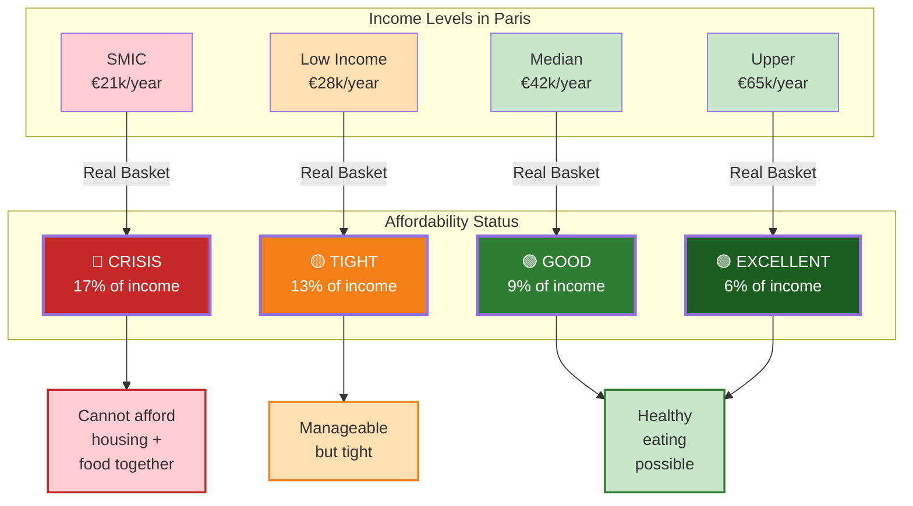
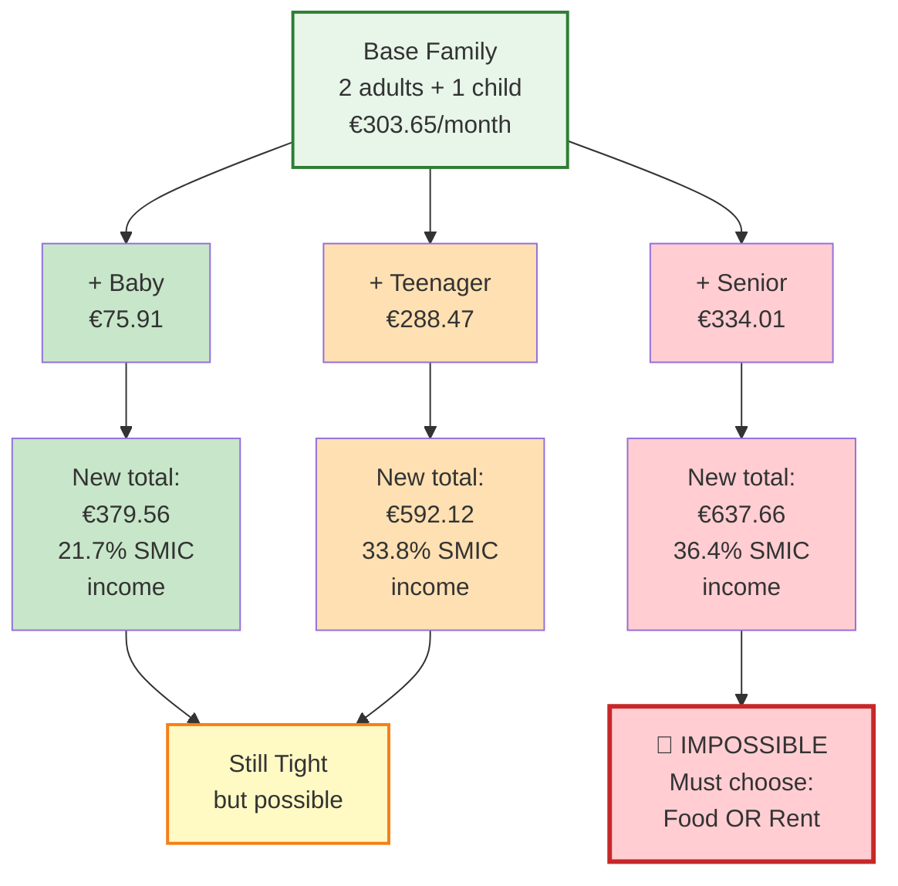
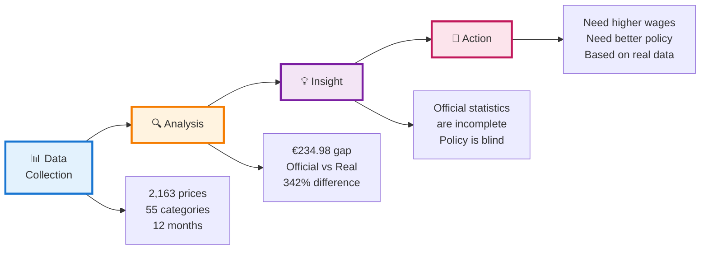

# Snipper Tool - Presentation-Friendly Diagrams

## Slide Diagram 1: From Receipt to Data (Simple Pipeline)

---

## Slide Diagram 2: The Three Baskets (Visual Comparison)

---

## Slide Diagram 3: Income Impact (Critical Insight)

---

## Slide Diagram 4: Household Composition Multiplier (The Crisis Factor)

---

## Slide Diagram 5: From Data to Decision (One-Pager Impact)

---

## Usage Notes

**For Presentations:**
- Use **Slide Diagrams 1-5** (simplified, colorful, easy to read)
- Each diagram fits well on one slide with title and callouts
- Color coding helps audience follow logic quickly

**For Reports:**
- Use **DIAGRAMS_ARCHITECTURE.md** detailed diagrams
- Diagrams 1-3 provide technical depth
- Can be embedded in documentation or appendices

**Diagram Meanings:**
- 🔴 Red = Crisis/Problem
- 🟡 Yellow = Caution/Difficult
- 🟢 Green = Good/Manageable
- Color intensity = severity level
