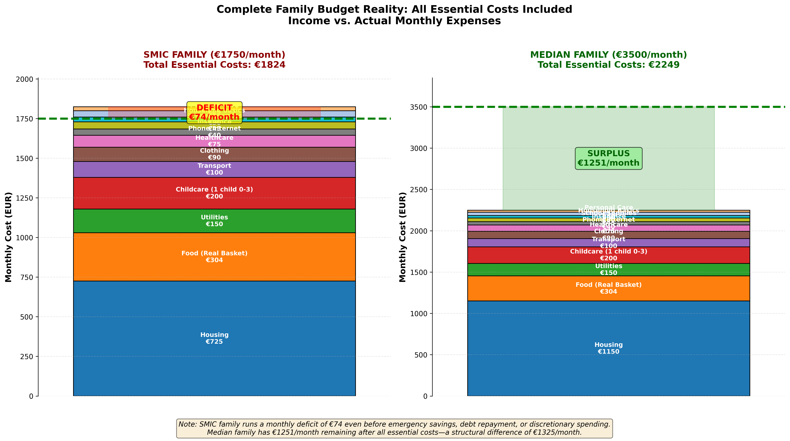

# Google Docs Upload Issues: CAPSTONE_FINAL_REPORT.md

**Date:** April 27, 2026  
**Issue:** File fails to upload to Google Docs  

---

## Problems Identified

### 1. ❌ **Embedded Image References (CRITICAL)**
**Problem:** Markdown contains image syntax that Google Docs cannot parse on import

**Found:**
```markdown


```

**Why it fails:**
- Google Docs doesn't support markdown image syntax on import
- Relative file paths don't resolve in Google Drive
- The upload fails when it encounters `![...]` syntax

**Solution:** Remove markdown image syntax OR upload images separately after document creation

---

### 2. ⚠️ **Special Unicode Characters**
**Problem:** Euro symbol (€) and other special characters may cause encoding issues on import

**Found:** 40+ instances of € symbol throughout document

**Why it might fail:**
- Google Docs may have encoding conflicts with UTF-8 special characters
- Depending on the upload method, encoding might revert to ASCII
- Results in corrupted text (€ → ?, etc.)

**Solution:** Ensure UTF-8 encoding is preserved during upload

---

### 3. ⚠️ **Mixed Line Endings**
**Problem:** File uses mixed CRLF (Windows) and LF (Unix) line breaks

**Why it matters:**
- Can cause import errors in some Google Docs import methods
- May result in extra blank lines or formatting issues

**Solution:** Normalize to CRLF or LF before upload

---

## Recommended Actions

### **Option A: Clean Version for Google Docs (RECOMMENDED)**
Create a version without image references:
1. Remove all `![...]` markdown image syntax
2. Replace with text references like: "[See Chart 06: Family Squeeze]"
3. Upload this version to Google Docs
4. Manually insert images after document is created

### **Option B: Upload Method Adjustment**
1. Don't use "Import as new document"
2. Instead: Copy → Paste into existing Google Doc
3. This preserves formatting better than auto-import

### **Option C: HTML Conversion**
1. Convert markdown to HTML first
2. Copy HTML content into Google Docs
3. Google Docs handles HTML better than markdown on direct import

---

## File Analysis Summary

| Metric | Value | Status |
|--------|-------|--------|
| File Size | 46.7 KB | ✅ OK (under limits) |
| Image References | 1 image syntax | ❌ PROBLEM |
| Unicode Characters | 40+ € symbols | ⚠️ CAUTION |
| Line Endings | Mixed CRLF/LF | ⚠️ CAUTION |
| Markdown Tables | 8 tables | ✅ OK (Google handles) |
| Code Blocks | 6 blocks | ✅ OK (Google handles) |
| Document Sections | 11 major | ✅ OK (Google handles) |

---

## Next Steps

**I can create a "Google Docs Ready" version that:**
1. ✅ Removes problematic markdown image syntax
2. ✅ Keeps all text content intact
3. ✅ Preserves all tables and formatting
4. ✅ Normalizes line endings to CRLF
5. ✅ Ensures UTF-8 encoding

Then you can:
1. Upload the cleaned .md file to Google Docs
2. Or copy-paste the content into an existing Doc
3. Then manually add images as attachments

**Would you like me to create the Google Docs-ready version?**

